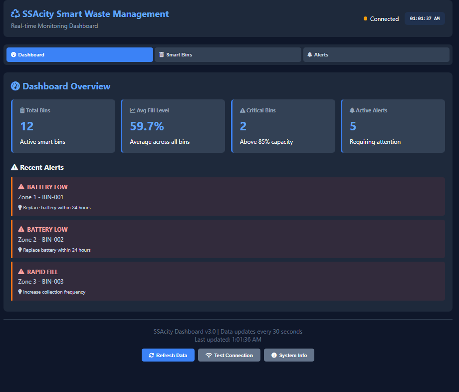
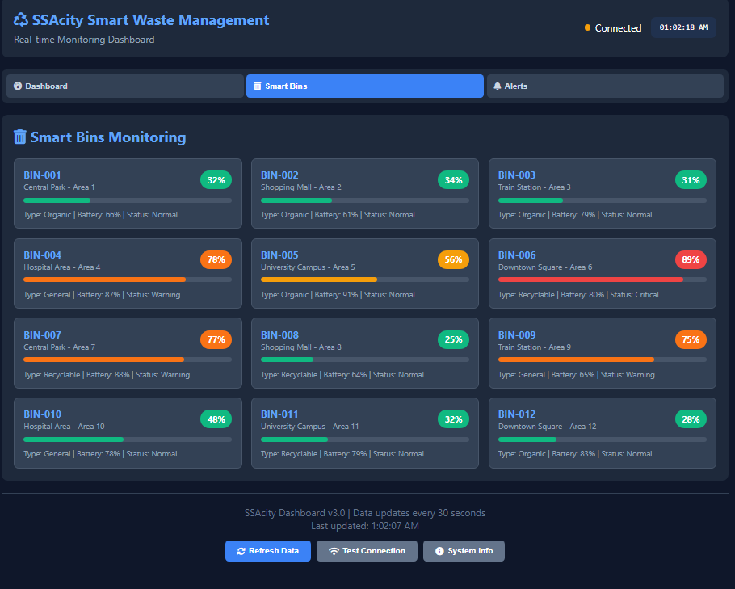
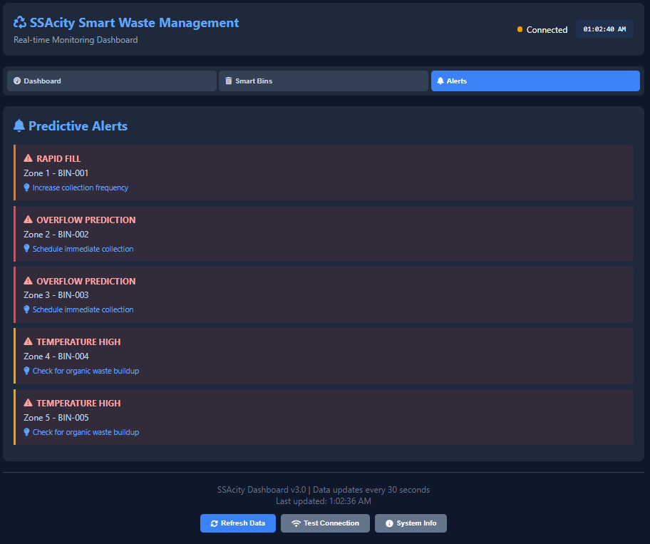

# SSAcity Smart Waste Management System

## Overview
A real-time smart city dashboard for monitoring waste bin fill levels with predictive alerts and operational analytics. The system provides municipal authorities with actionable insights for efficient waste management.

## Key Features
- **Real-time Monitoring**: Live tracking of 12+ smart waste bins
- **Predictive Analytics**: Early warning system for overflow prediction
- **Smart Alerts**: Battery level warnings, rapid fill detection, temperature monitoring
- **Operational KPIs**: Dashboard with key performance indicators
- **Responsive Interface**: Auto-refreshing data every 30 seconds

## Dashboard Interface

### Dashboard Overview

*Figure 1: Dashboard Overview - Real-time monitoring of waste bin metrics, including total bins, average fill levels, critical bins, and active alerts.*

The main dashboard provides an at-a-glance view of the entire waste management system, showing key performance indicators and recent alerts that require immediate attention.

### Smart Bins Monitoring

*Figure 2: Smart Bins Monitoring - Detailed view of all waste bins showing fill levels, battery status, waste types, and current status.*

Monitor individual smart bins with color-coded fill levels, allowing waste management teams to prioritize collection routes based on actual need rather than fixed schedules.

### Predictive Alerts System

*Figure 3: Predictive Alerts - Early warning system showing overflow predictions, rapid fill alerts, and temperature anomalies.*

The predictive alerting system proactively identifies potential issues before they become critical, enabling preventive maintenance and optimized collection scheduling.

## Technology Stack
- **Backend**: Flask REST API with Python
- **Frontend**: HTML5, CSS3, JavaScript
- **Data Simulation**: Python-based data simulator for testing
- **Deployment**: Local server with auto-restart capabilities

## Project Structure
```
ssacity-smart-waste/
├── backend/           # Flask application
│   ├── app.py        # Main backend server
│   ├── advanced_backend.py
│   ├── models.py     # Data models
│   ├── data_pipeline.py
│   └── requirements.txt
├── frontend/         # Dashboard interface
│   ├── index.html    # Main dashboard (Figure 1-3)
│   └── dashboard.js  # Frontend logic
├── README.md         # This documentation
├── images/           # Screenshots directory
│   ├── dashboard.png
│   ├── smart-bins.png
│   └── alerts.png
└── .gitignore        # Git exclusion rules
```

## Installation & Setup
1. **Clone the repository**:
   ```bash
   git clone https://github.com/YOUR_USERNAME/ssacity-smart-waste.git
   cd ssacity-smart-waste
   ```

2. **Setup Backend**:
   ```bash
   cd backend
   python3 -m venv venv
   source venv/bin/activate  # On Windows: venv\Scripts\activate
   pip install -r requirements.txt
   python3 app.py
   ```

3. **Launch Frontend**:
   ```bash
   cd frontend
   python3 -m http.server 8001
   ```

4. **Access Dashboard**: Open browser to `http://localhost:8001`

## Usage
- **Dashboard Tab**: View overall metrics and recent alerts (Figure 1)
- **Smart Bins Tab**: Monitor individual bin status and fill levels (Figure 2)
- **Alerts Tab**: Review predictive alerts and recommended actions (Figure 3)
- **Auto-refresh**: Data updates automatically every 30 seconds
- **Manual Refresh**: Click "Refresh Data" button for immediate update

## API Endpoints
The backend provides the following REST endpoints:
- `GET /health` - Service health check
- `GET /api/v2/smart-bins` - Retrieve all smart bin data
- `GET /api/v2/predictive-alerts` - Get active alerts
- `GET /api/v2/operational-kpis` - Fetch dashboard metrics

## Features Demonstrated in Screenshots

### Figure 1: Dashboard Overview
- Total active bins monitoring
- Average fill level calculation
- Critical bins identification (>85% capacity)
- Recent alerts display with recommended actions

### Figure 2: Smart Bins Monitoring
- Individual bin status with color-coded fill levels
- Battery level indicators
- Waste type categorization (Organic, General, Recyclable)
- Location-based organization

### Figure 3: Predictive Alerts
- Overflow prediction warnings
- Rapid fill rate detection
- Temperature monitoring for organic waste
- Priority-based alert system

## Development
To modify or extend the system:
1. Backend logic: Edit `backend/app.py` and `backend/models.py`
2. Frontend design: Modify `frontend/index.html` and `frontend/dashboard.js`
3. Data simulation: Adjust `backend/data_simulator.py` for testing
4. Add new endpoints in backend and corresponding frontend calls

## Contributing
1. Fork the repository
2. Create a feature branch
3. Commit changes
4. Push to the branch
5. Create a Pull Request

## License
This project is available for educational and demonstration purposes.

## Contact
For questions or feedback, please open an issue in the GitHub repository.